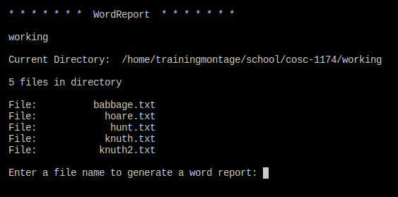
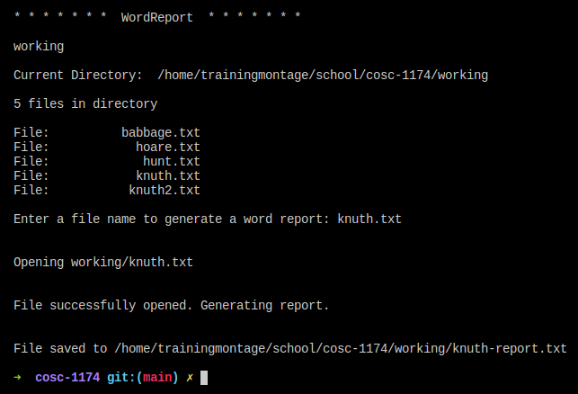

# WordReport

## Usage

WordReport is a very simple program. When run, it will present a selection of `.txt` files to the user. The user can type the name of one of the files to generate a report of the occurrences of each word in the text of that file. The report will then be saved to the same directory as the text file with `-report.txt` appended to differentiate it from the other files in the directory.

To run WordReport, navigate to the `src` directory and run `javac App.java` to compile. Then run `java App` to run the application.
### Screenshots

### Class Diagram

