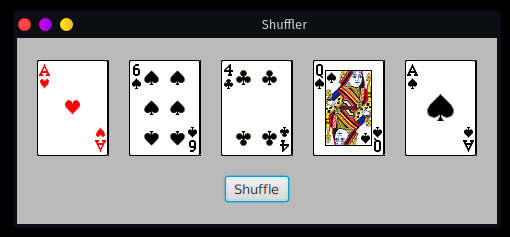
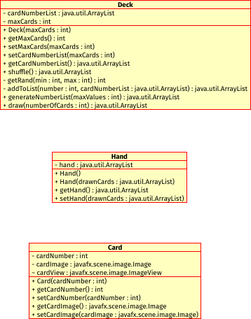

# Shuffler

To run the Shuffler app, navigate to the `src` directory located within the `Poker1` project directory. Running the program is a two-step process and will require running two commands:


1. Type or copy/paste the following command into the terminal after navigating to `Poker1/src`:

```bash
javac --module-path ../lib --add-modules javafx.controls,javafx.fxml App.java
```

2. Type or copy/paste the following command into the terminal to run the compiled program:

```bash
java --module-path ../lib --add-modules javafx.controls,javafx.fxml App
```

You should now see a window that looks similar to this:



Press the `Shuffle` button to get a new set of cards. You can keep shuffling forever, if you like, but that's really all this program does!

When you're finished shuffling, just close the window however you normally close windows in your operating system or window manager of choice.


## Class diagram


