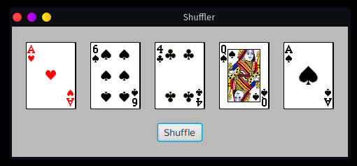
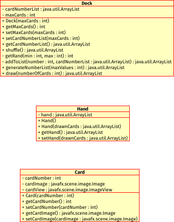

# Shuffler

## Usage

### Prerequisites

You will need a copy of the JavaFX SDK in order to run this program. You can find it at [https://gluonhq.com/products/javafx/](https://gluonhq.com/products/javafx/). Simply download the correct archive file for your chosen operating system. Extract the contents of the archive to a location on your hard drive (for example: `C:\javafx-sdk-15.0.1` or `/home/userName/javafx-sdk-15.0.1`). Inside of the extracted folder we will need to reference the location of the `lib` directory. If you extracted the JavaFX SDK version `15.0.1` to your `C:\` drive on Windows it will be `C:\javafx-sdk-15.0.1\lib`, if you're on a Linux or macOs system it will look a little different but will be something like `/home/yourUsername/javafx-sdk-15.0.1/lib`.

Go ahead and copy the location of that `lib` directory. We'll use it in the next two steps and we'll be calling it `%JAVAFX_SDK_LOCATION%`


### Running the app

To run the Shuffler app, navigate to `Poker1` directory. Running the program will require executing two commands:

1. Type or copy/paste the following command into the terminal after navigating to `Poker1`:

```bash
javac --module-path %JAVAFX_SDK_LOCATION% --add-modules javafx.controls,javafx.fxml App.java
```

2. Type or copy/paste the following command into the terminal to run the compiled program:

```bash
java --module-path %JAVAFX_SDK_LOCATION% --add-modules javafx.controls,javafx.fxml App
```

You should now see a window that looks similar to this:





Press the `Shuffle` button to get a new set of cards. You can keep shuffling forever, if you like, but that's really all this program does!

When you're finished shuffling, just close the window however you normally close windows in your operating system or window manager of choice.

## Class diagram


